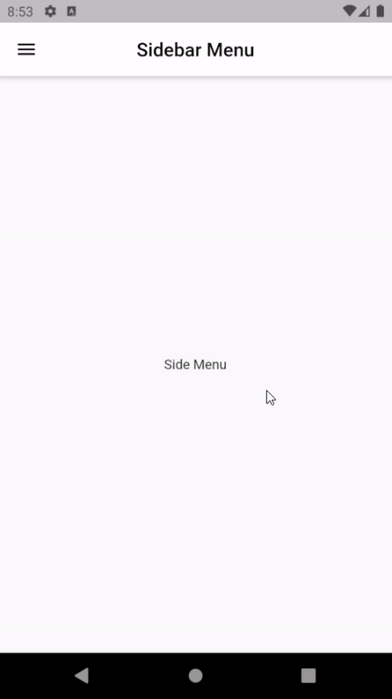
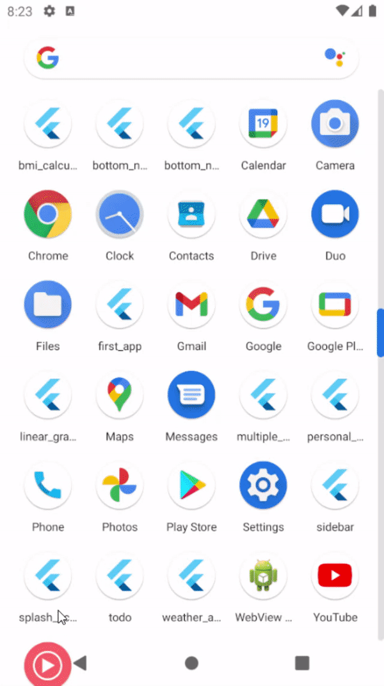
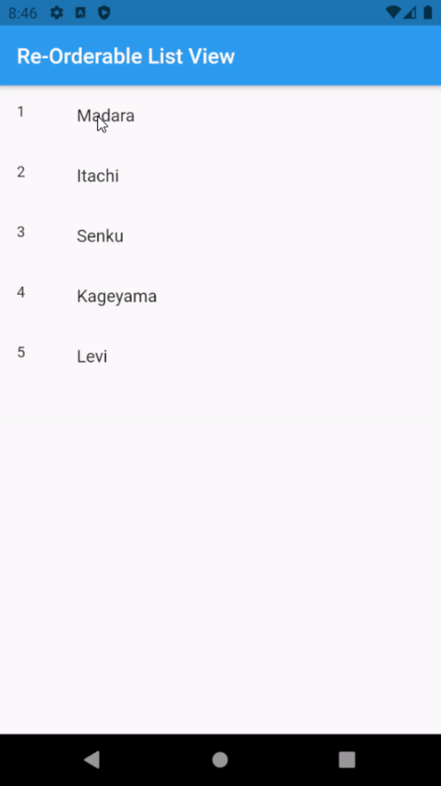

# Flutter-Useful-Widgets

## Multiple Floating Action Button

## Linear Gradient

## SideBar

## Splash Screen

## Bottom Navigation Bar with Notch

## Bottom Navigation Bar with Circular Button In-Between

## Light/Dark Mode

## Material Banner

## Sliding Up Panel

## Reorderable List View
